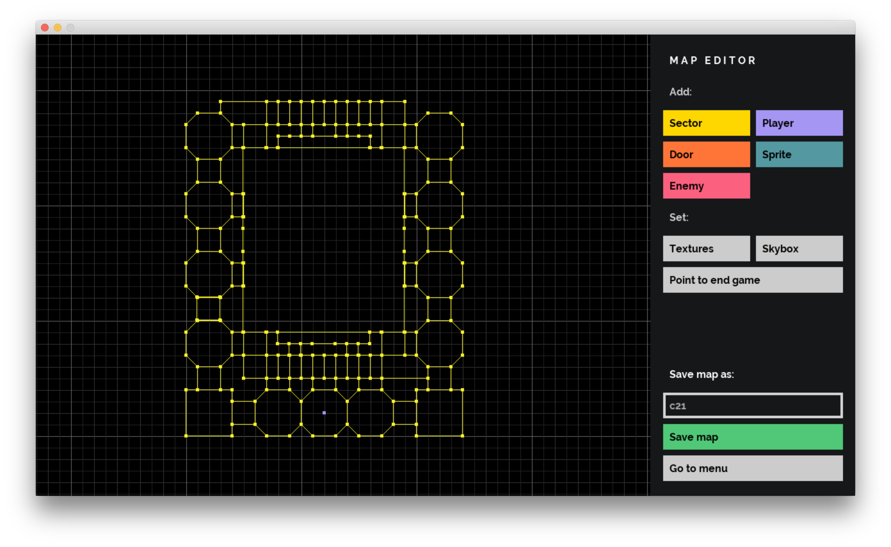

# Doom Nukem

This game is a mix of Doom and Duke Nukem 3D. We implemented some basics functional elements and added new functionality. It was funny.

# How to use

We used Make (Makefile, Mac Os) as a build automation tool.

    $> make -j32
    $> ./doom_nukem (standard pack)
    or
    $> ./doom_nukem [filename]

# Map editor

You can use standard functional for creating game maps.

# Game interface

## Some standard actions

W/A/S/D — player movement

Space — jump

⇧Shift — squat

E — open the door/click on a game action button

Click on the mouse wheel — Fly mode (Q/E — fly height modifier)

Click on the left mouse button — shot

ESC — exit

# Author

[danjos91](https://github.com/danjos91)

[lokswin](https://github.com/lokswin)

[nasvetil](https://github.com/nasvetil)

[tjuana](https://github.com/tjuana)
